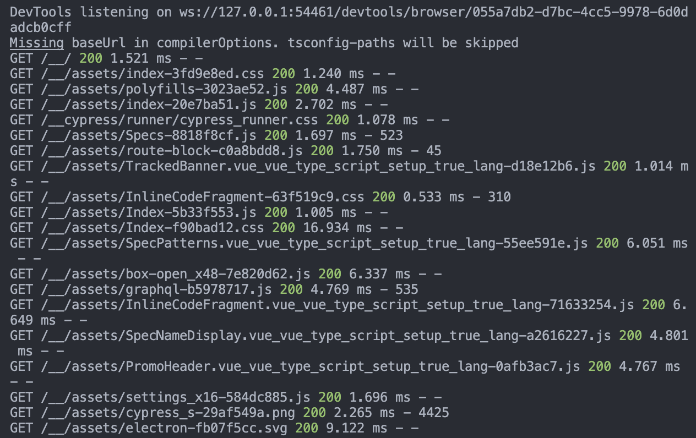
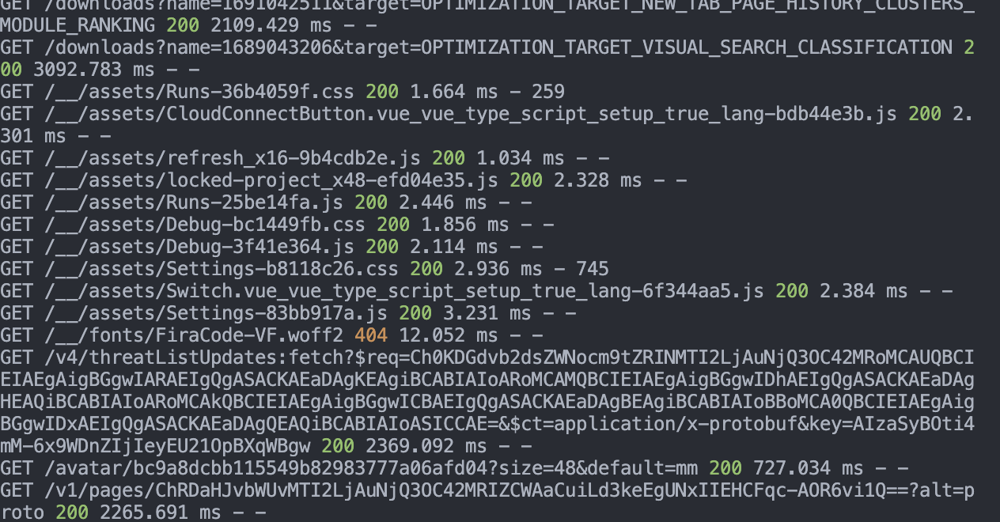

# Ejercicio QA

En este archivo se listan los prompts necesarios para llegar a la solución del ejercició que consiste en:

Probar la interfaz "position" con Cypress. Vamos a asegurarnos de que la interfaz funciona correctamente mediante pruebas End-to-End (E2E).

Crear Pruebas E2E para la Interfaz "position":

## Carga de la Página de Position

- Verifica que el título de la posición se muestra correctamente.
- Verifica que se muestran las columnas correspondientes a cada fase del proceso de contratación.
- Verifica que las tarjetas de los candidatos se muestran en la columna correcta según su fase actual.

## PROMP 1

Como parte del equipo de desarrollo de la aplicación LTI, vas actuar como el experto de QA.

Las pruebas se necesitan realizar con cypress y el frontend esta escrito en React, tal como esta definido en la estructura del proyecto @README.md

Antes necesito que me explique que son las pruebas E2E, y me listes como las podríamos integrar en el proyecto @frontend. Y si requieres de más información dimelo.

<details><summary> Respuesta </summary>

Explanation of E2E Testing

End-to-end (E2E) testing is a technique used to test whether the flow of an application, from start to finish, behaves as expected. It aims to replicate real user scenarios, ensuring that the system works as a whole and interacts with external systems and interfaces correctly. In the context of a web application, E2E tests simulate user interactions with the application in a browser, verifying that all layers of the application stack (frontend, backend, database, etc.) work together as intended.
Integrating E2E Testing in the LTI Project
To integrate E2E testing into the LTI project, which uses a React frontend, you can use Cypress, a popular testing framework for web applications. Here are the steps to integrate Cypress for E2E testing:

1. Install Cypress: Add Cypress to your project's development dependencies.

   ```sh
   npm install --save-dev cypress
   ```

2. Configure Cypress: Set up the initial configuration and test structure.

    This command sets up Cypress and opens its test runner, which creates a cypress folder with example tests.

   ```sh
   npx cypress open
   ```

3. Write E2E Tests: Create test files within the cypress/integration directory. Here’s an example of a simple E2E test that checks if the main page loads and contains specific elements:

   ```js
   describe('Main Page', () => {
     it('successfully loads', () => {
       cy.visit('http://localhost:3000') // change URL to match your local or staging environment
       cy.contains('Dashboard del Reclutador') // checks if the text is present in the document
     });
   });
   ```

4. Run Tests: Execute the tests using the Cypress test runner or via the command line.
    This command runs the tests in headless mode, which is useful for continuous integration environments.

   ```sh
   npx cypress run
   ```

5. Integrate with CI/CD: Optionally, integrate Cypress tests into your CI/CD pipeline to ensure tests are automatically run with every build or deployment.

6. Maintain and Expand Tests: As the application grows and changes, continuously update and expand the test suite to cover new features and changes.
By following these steps, you can set up E2E testing for the LTI project, enhancing the quality assurance process and ensuring the application behaves as expected from the user's perspective.

</details>

## PROMP_2

Se requiere añadir una prueba E2E para la interfaz "position". hay que verificar el siguiente escenario:

Carga de la Página de Position:

- Verifica que el título de la posición se muestra correctamente.
- Verifica que se muestran las columnas correspondientes a cada fase del proceso de contratación.
- Verifica que las tarjetas de los candidatos se muestran en la columna correcta según su fase actual.

Aun no escribas código, listame el paso a paso para el desarrollo de estas pruebas teniendo en cuenta que soy una desarrolladora junior. Y hazme las preguntas que consideres necesarias.

<details><summary> Respuesta </summary>

Paso a Paso para Desarrollar Pruebas E2E para la Interfaz "Position"
Para desarrollar pruebas E2E para la interfaz "Position" en Cypress, sigue estos pasos detallados:
Configuración Inicial:
Asegúrate de que Cypress esté instalado y configurado en tu proyecto. Si no lo has hecho, revisa los pasos de instalación y configuración que te proporcioné anteriormente.
Estructura de Archivos:
Crea un nuevo archivo de prueba en el directorio cypress/integration. Puedes nombrarlo position_spec.js.
Escribir Pruebas:
Abre el archivo position_spec.js y comienza a escribir las pruebas. Utiliza describe para definir el conjunto de pruebas y it para cada prueba individual.
Prueba para Cargar la Página:
Escribe una prueba para asegurarte de que la página de posición se carga correctamente.

```js
   describe('Position Page', () => {
     it('successfully loads', () => {
       cy.visit('http://localhost:3000/positions'); // Asegúrate de que la URL es correcta
     });
   });
   ```

Verificar el Título de la Posición:
Añade una prueba para verificar que el título de la posición se muestra correctamente.

```js
   it('displays the correct position title', () => {
     cy.contains('Posiciones').should('be.visible');
   });
```

Verificar las Columnas del Proceso de Contratación:
Añade una prueba para verificar que las columnas del proceso de contratación se muestran correctamente.

```js
   it('displays the correct columns for hiring stages', () => {
     cy.get('.column-class-name').should('have.length', 4); // Asegrate de reemplazar 'column-class-name' con la clase CSS real
   });
```

Verificar las Tarjetas de los Candidatos:
Añade una prueba para verificar que las tarjetas de los candidatos se muestran en la columna correcta según su fase actual.

```js
   it('displays candidate cards in the correct columns', () => {
     cy.get('.candidate-card-class-name').each(card => {
       cy.wrap(card).find('.stage-class-name').should('contain', 'Nombre de la Etapa'); // Asegúrate de reemplazar los nombres de clase y texto con los valores reales
     });
   });
```

Ejecutar Pruebas:
Ejecuta las pruebas para asegurarte de que todo funciona como se espera.

```sh
   npx cypress open
```

- Selecciona el archivo position_spec.js en la interfaz de usuario de Cypress para ejecutar las pruebas específicas.

Revisión y Ajustes:
Observa los resultados de las pruebas y realiza ajustes si alguna prueba falla o no se comporta como se espera.
Mantenimiento Continuo:
A medida que la interfaz cambie o se añadan nuevas características, actualiza y expande las pruebas para cubrir estos cambios.
Preguntas para Clarificar el Escenario de Prueba
¿Hay algún dato específico o configuración que deba ser preestablecida antes de ejecutar las pruebas?
¿Existe alguna preferencia en cuanto a los navegadores o entornos en los que deberían ejecutarse las pruebas?
¿Cómo se manejan los datos de prueba? ¿Necesitamos configurar algún estado inicial en la base de datos o utilizar datos mock?
Siguiendo estos pasos y aclarando estas preguntas, podrás desarrollar pruebas E2E robustas para la interfaz "Position".

A las preguntas de configuraciones ten en cuenta el archvo @package.json para las versiones y la base se popula con los datos de prueva @prisma con @seed.ts 

Final Context in Folders
Paso a Paso para Desarrollar Pruebas E2E para la Interfaz "Position"
Para desarrollar pruebas E2E para la interfaz "Position" en Cypress, sigue estos pasos detallados:
Configuración Inicial:
Asegúrate de que Cypress esté instalado y configurado en tu proyecto. Si no lo has hecho, revisa los pasos de instalación y configuración que te proporcioné anteriormente.
Estructura de Archivos:
Crea un nuevo archivo de prueba en el directorio cypress/integration. Puedes nombrarlo position_spec.js.
Escribir Pruebas:
Abre el archivo position_spec.js y comienza a escribir las pruebas. Utiliza describe para definir el conjunto de pruebas y it para cada prueba individual.
Prueba para Cargar la Página:
Escribe una prueba para asegurarte de que la página de posición se carga correctamente.
   describe('Position Page', () => {
     it('successfully loads', () => {
       cy.visit('http://localhost:3000/positions'); // Asegúrate de que la URL es correcta
     });
   });
Verificar el Título de la Posición:
Añade una prueba para verificar que el título de la posición se muestra correctamente.
   it('displays the correct position title', () => {
     cy.contains('Posiciones').should('be.visible');
   });
Verificar las Columnas del Proceso de Contratación:
Añade una prueba para verificar que las columnas del proceso de contratación se muestran correctamente.
   it('displays the correct columns for hiring stages', () => {
     cy.get('.column-class-name').should('have.length', 4); // Asegúrate de reemplazar 'column-class-name' con la clase CSS real
   });
Verificar las Tarjetas de los Candidatos:
Añade una prueba para verificar que las tarjetas de los candidatos se muestran en la columna correcta según su fase actual.
   it('displays candidate cards in the correct columns', () => {
     cy.get('.candidate-card-class-name').each(card => {
       cy.wrap(card).find('.stage-class-name').should('contain', 'Nombre de la Etapa'); // Asegúrate de reemplazar los nombres de clase y texto con los valores reales
     });
   });
Ejecutar Pruebas:
Ejecuta las pruebas para asegurarte de que todo funciona como se espera.
   npx cypress open

Revisión y Ajustes:
Observa los resultados de las pruebas y realiza ajustes si alguna prueba falla o no se comporta como se espera.
Mantenimiento Continuo:
A medida que la interfaz cambie o se añadan nuevas características, actualiza y expande las pruebas para cubrir estos cambios.
</details>

## Resultado test





## PROMP_3

Ahora necesito añadir un nuevo test para validar el escenario de Cambio de Fase de un Candidato:

- Simula el arrastre de una tarjeta de candidato de una columna a otra.
- Verifica que la tarjeta del candidato se mueve a la nueva columna.
- Verifica que la fase del candidato se actualiza correctamente en el backend mediante el endpoint PUT /candidate/:id.

Sin escribir aún el test, listame el paso a paso para el desarrollo de estas pruebas teniendo en cuenta que soy una desarrolladora junior. Y hazme las preguntas que consideres necesarias. Y toma tambien ya la información aportada.

<details><summary> Respuesta </summary>

Paso a Paso para Desarrollar la Prueba E2E del Cambio de Fase de un Candidato
Para desarrollar la prueba E2E que simula el cambio de fase de un candidato en Cypress, sigue estos pasos:

1. Preparación de Datos:
Asegúrate de que los datos iniciales necesarios estén configurados en la base de datos. Esto incluye tener candidatos asignados a diferentes fases.
2. Estructura de Archivos:
Utiliza el archivo existente position_spec.js en el directorio cypress/integration.

</details>